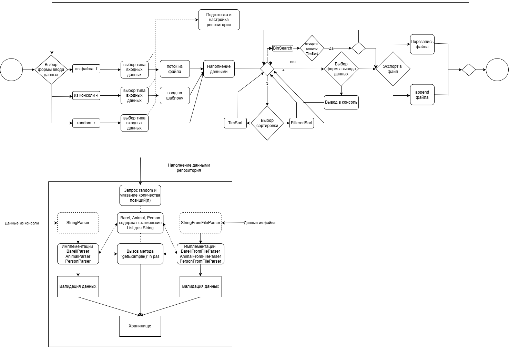

An explanation of the progress of the program is shown in the action diagram below:

Test coverage in version 1.0.0:

Classes (Class, %): 57% covered (16 out of 28 classes).
Methods (Method, %): 62% are covered (82 out of 131 methods).
Lines (Line, %): 48% is covered (343 out of 693 lines of code).
